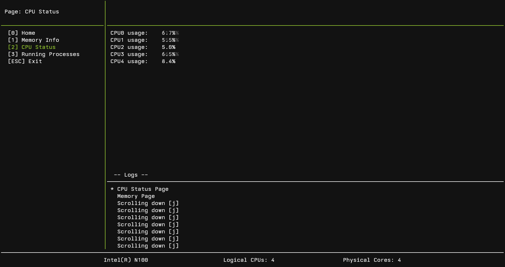
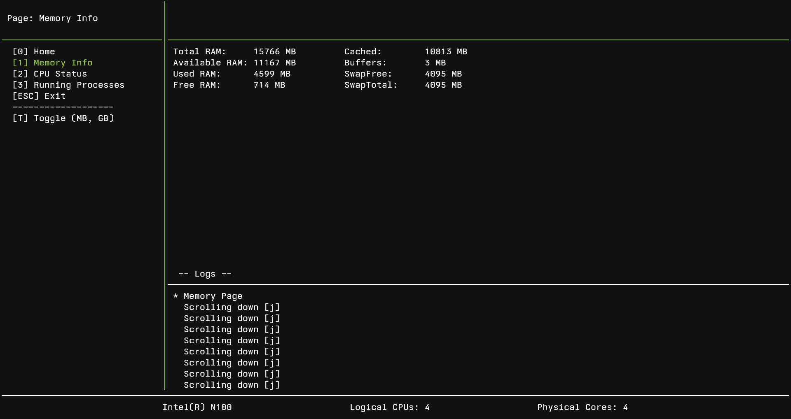
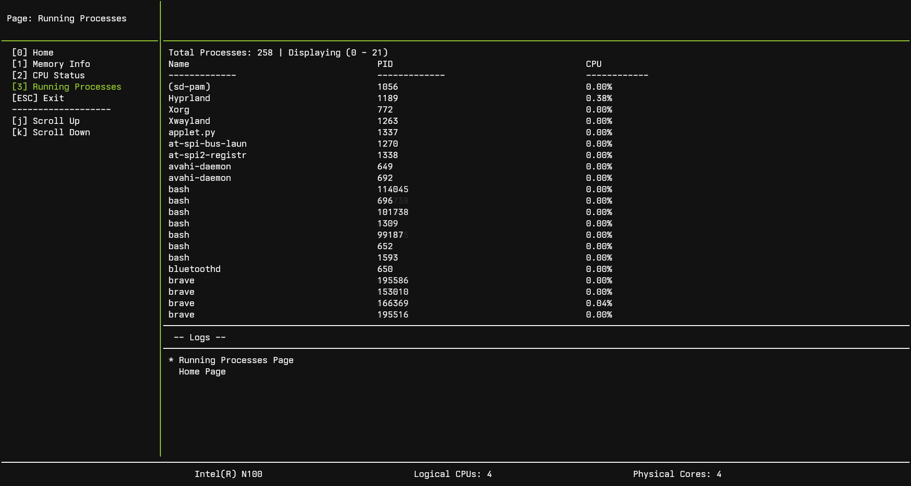
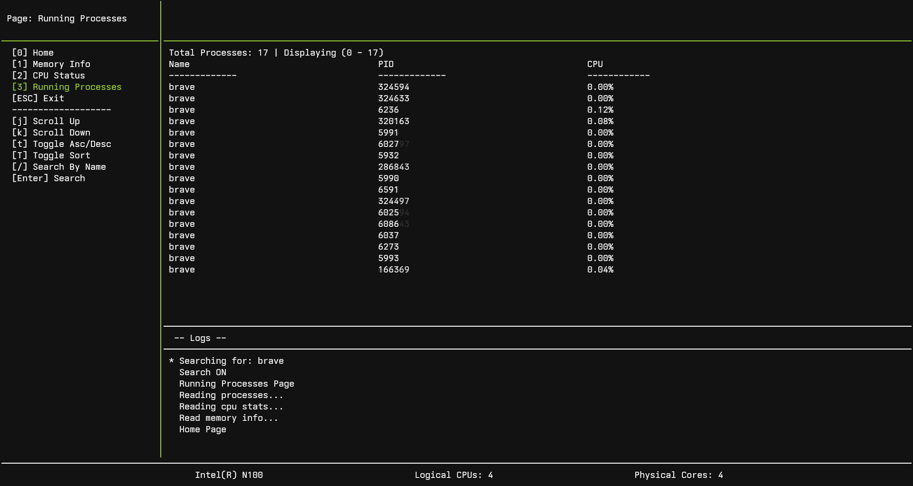
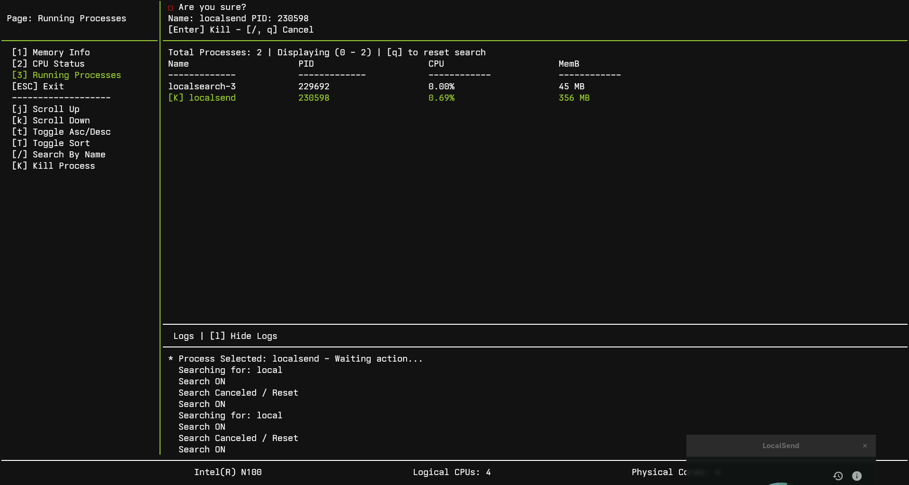

# sysmontui
[Sysmon](https://github.com/omar0ali/sysmon) is a library I created for the [sysmontui](#) application. The goal is to build a terminal-based system monitor, similar to `htop`, but with a unique user interface.

### Features
- Read system metrics from `/proc` using [https://github.com/omar0ali/sysmon](sysmon) library.
- CPU usage information
- Memory statistics
- List of processes


### Checklist:
- [x] Showing CPU Status
- [x] Showing Memory Info
- [x] Showing list of processes
- [x] Support sorting processes by different fields (name, PID, etc.) and ordering (Ascending, Descending)
- [x] Search processes by name
- [x] Kill process
- [X] Show and Hide logs using `[l]` key

### Requirements
Linux only (uses /proc)

### Screenshots
#### CPU Status

#### Memory Info

#### Running Processes

#### Sorting By (name, pid, cpu usage) and ordering (asc, desc)
.png)
.png)
#### Search processes by name

#### Kill process - sending SIGTERM


## Installation

### From source
```bash
git clone https://github.com/omar0ali/sysmontui.git
cd sysmontui
go build -o build/sysmontui cmd/sysmontui/main.go

#Run
./build/sysmontui
```

### Using Go (recommended) - Linux only
```bash
go install github.com/omar0ali/sysmontui/cmd/sysmontui@latest
```

### Status
Work in progress

## Third-Party Licenses
This project uses [tcell](https://github.com/gdamore/tcell) (Apache License 2.0):
https://github.com/gdamore/tcell
